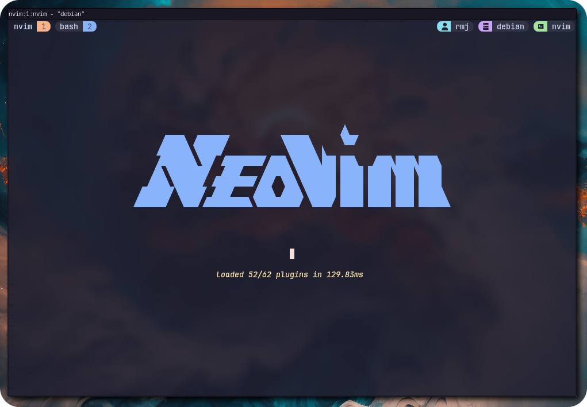
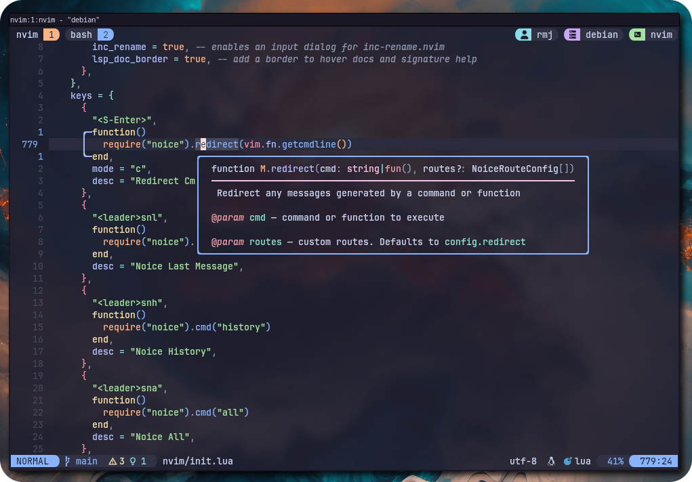

# Lionyx Neovim Config

A nice `kickstart.nvim` based config with many batteries included.

If you want to start `kickstart.nvim` from scratch, visit their
[repository](https://github.com/nvim-lua/kickstart.nvim).

Have you ever tried Emacs? Curious about it? Check out this amazing repo,
bringing the power of `kickstart.nvim` to Emacs:
[emacs-kick](https://github.com/LionyxML/emacs-kick).

Checkout my blog: [rahuljuliato.com](https://rahuljuliato.com)
